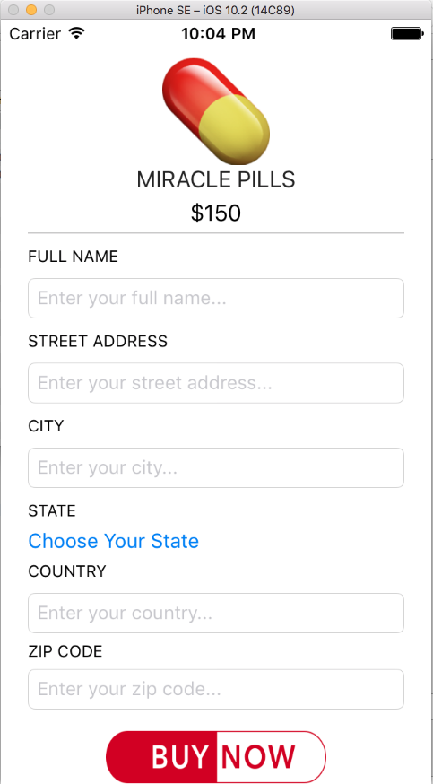
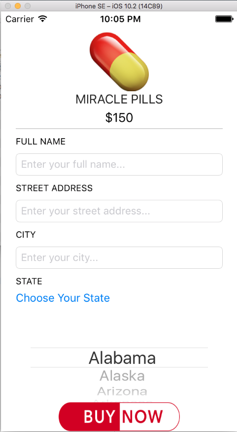
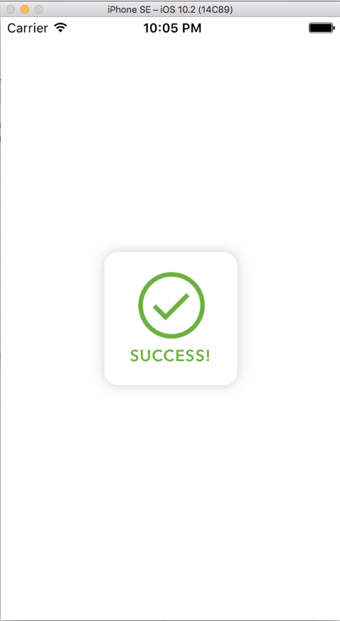

# MiraclePills

A very basic app that displays images, labels and text fields. A UIPicker view is utilised to let the user select their state from an array. Once the user presses the "Buy Now" button all images shown are set to hidded and a "Success" image is unhidden.

Note: App was only designed for the iPhone SE

## Screenshots of the Miracle Pills App

                         Above: Screenshot of the "Main" screen in the Miracle Pills app

        Above: Screenshot of the "Choose State" screen in the Miracle Pills app (Country and Zip labels hidden)

                         Above: Screenshot of the "State Selected" screen in the Miracle Pills app

                         Above: Screenshot of the "Success" screen in the Miracle Pills app

Code Source: DevSlopes - https://devslopes.com
